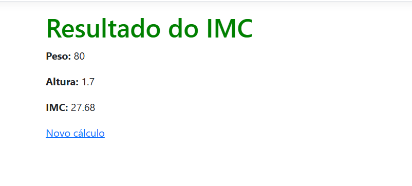

# Calculadora de IMC ASP.NET MVC

Igor Cutrim Fernandes

RA: 926103610

Esta aplicação foi desenvolvida utilizando ASP.NET MVC.

O sistema recebe o peso e a altura do usuário através de um formulário. Os dados são enviados para o Controller, onde o cálculo do IMC é realizado no lado do servidor (Server Side).

Após o cálculo, o resultado é exibido em uma página de confirmação mostrando o IMC calculado.

Fórmula utilizada:

IMC = Peso / (Altura × Altura)
