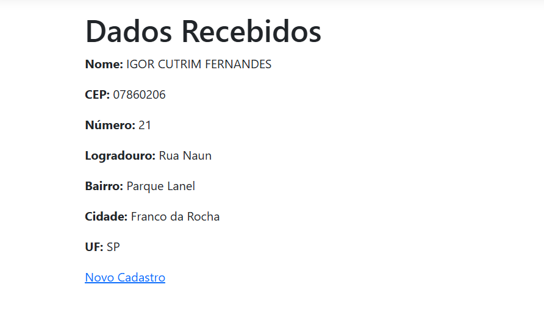

# Calculadora de IMC ASP.NET MVC

Igor Cutrim Fernandes

RA: 926103610

# Consulta CEP ASP.NET MVC

Aplicação desenvolvida em ASP.NET MVC utilizando integração com a API ViaCEP.

O usuário informa seu nome, CEP e número da residência. Ao sair do campo CEP, uma requisição AJAX utilizando jQuery consulta a API ViaCEP e preenche automaticamente os campos de endereço (logradouro, bairro, cidade e UF).

Os dados são enviados para o Controller através de Model Binding e exibidos em uma página de confirmação somente leitura.

## Tecnologias utilizadas

- ASP.NET MVC
- C#
- jQuery
- AJAX
- ViaCEP API

## Funcionalidades

- Consulta automática de CEP
- Preenchimento automático do endereço
- Model Binding
- Página de confirmação

## Print da aplicação

